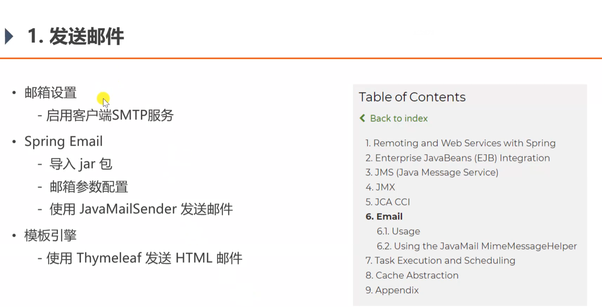
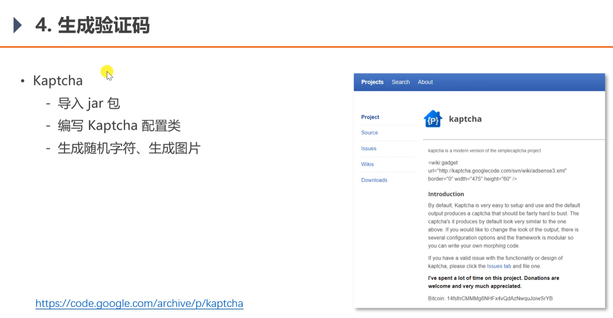
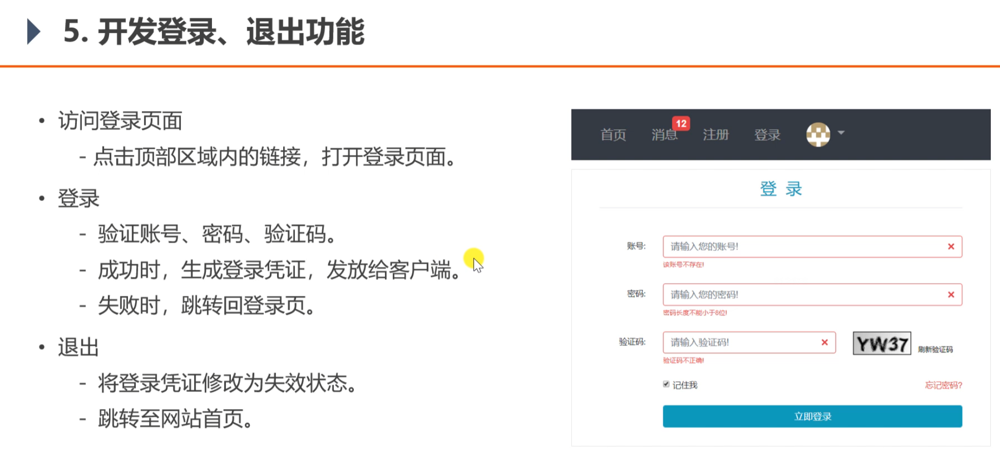

<h1>项目功能实现</h1>

<h2>发送邮件功能</h2>



``
<dependency>
<groupId>org.springframework.boot</groupId>
<artifactId>spring-boot-starter-mail</artifactId>
</dependency>
``

<h2>会话管理</h2>

问题：怎么解决多台服务器的session问题？
答：能使用cookie存的就用cookie，不能的使用redis集群存储数据。
几种解决方案：
1.固定的ip给固定的服务器处理，但是造成服务器的压力不均衡的情况
2.把session在服务器间进行复制，但是造成空间浪费情况
3.把session数据存在sql数据库，也会造成数据库的压力
4.把session数据存在nosql数据库

<h2>生成验证码</h2>


<h2>登陆功能</h2>

1. 登陆时，先验证验证码，然后再从service中调用方法获得ticket,能获取到，说明这个用户可以登陆，就向客户端返回
一个cookie,cookie中包含ticket,路径和时间

<h2>thymeleaft模板参数使用</h2>
1. 填写账号密码时，提醒错误是有错误才提醒，没有错误不提醒
class="form-control is-invalid" -> th:class="|form-control ${usernameMsg!=null?'is-invalid':''}|"
  
2. 填写账号密码错误提醒要动态的显示：
   th:text="${passwordMsg}


3. 填写账号密码时，如果要记住上一次填写的，但是参数是分开写的，没有封装在model里面，可以这样写：
th:value="${param.password}"
   
4. 填写账号密码时，标签上要带上name属性，值为方法中的参数名 
name="username"
   
5. 使用模板引擎时，要改掉所有的css和js的绝对路径：
```
<link rel="stylesheet" th:href="@{/css/login.css}" />
<script th:src="@{/js/global.js}"></script>
```

6. 