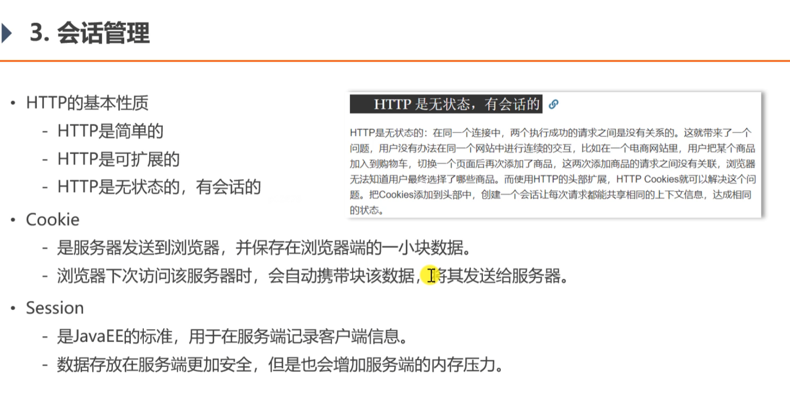
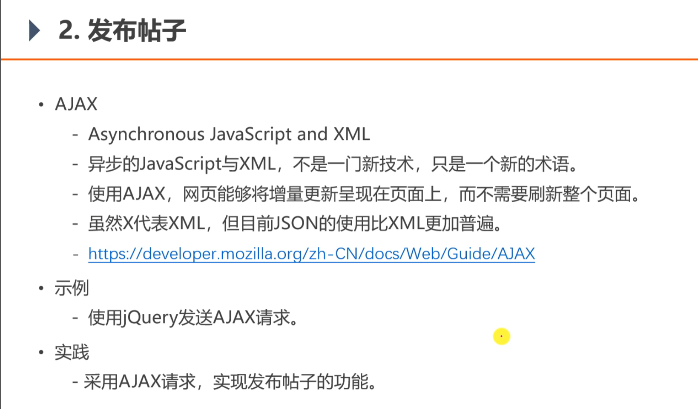
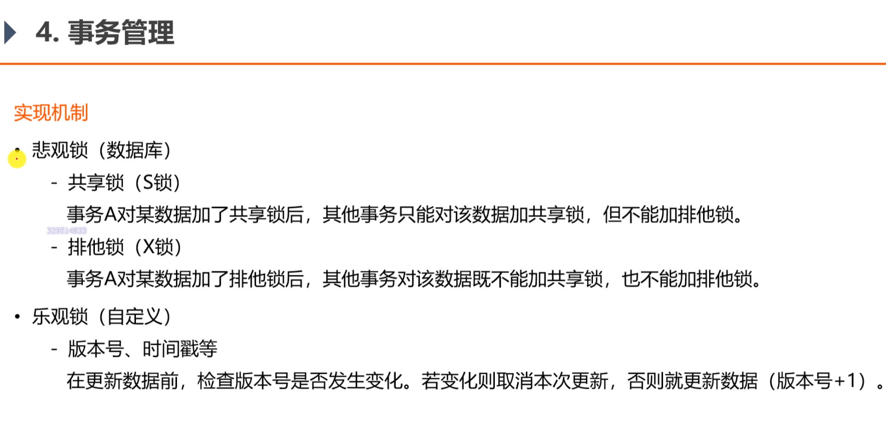
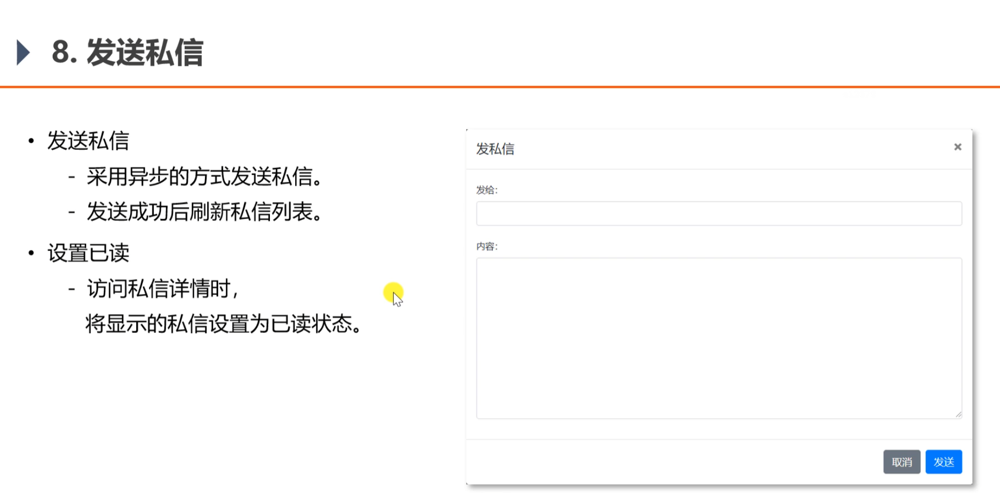
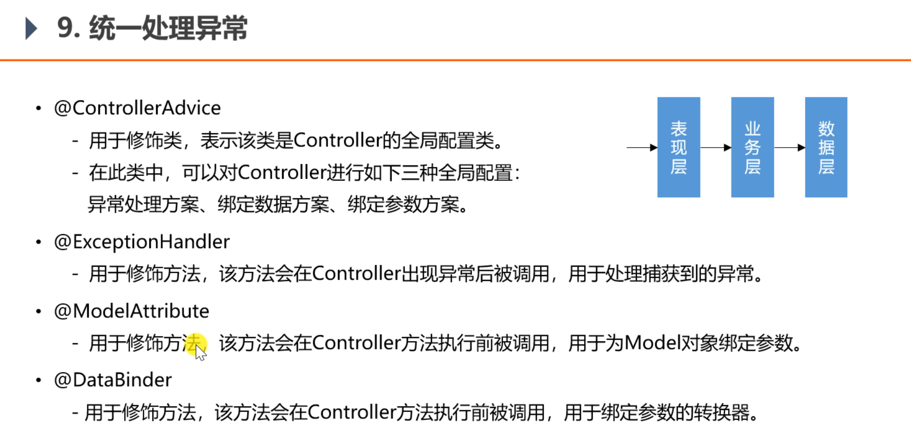

<h1>项目功能实现</h1>

<h2>发送邮件功能</h2>


``
<dependency>
<groupId>org.springframework.boot</groupId>
<artifactId>spring-boot-starter-mail</artifactId>
</dependency>
``

<h2>会话管理</h2>

问题：怎么解决多台服务器的session问题？
答：能使用cookie存的就用cookie，不能的使用redis集群存储数据。
几种解决方案：
1.固定的ip给固定的服务器处理，但是造成服务器的压力不均衡的情况
2.把session在服务器间进行复制，但是造成空间浪费情况
3.把session数据存在sql数据库，也会造成数据库的压力
4.把session数据存在nosql数据库

<h2>生成验证码</h2>


<h2>登陆功能</h2>

1. 登陆时，先验证验证码，然后再从service中调用方法获得ticket,能获取到，说明这个用户可以登陆，就向客户端返回
一个cookie,cookie中包含ticket,路径和时间

<h2>thymeleaft模板参数使用</h2>
1. 填写账号密码时，提醒错误是有错误才提醒，没有错误不提醒
class="form-control is-invalid" -> th:class="|form-control ${usernameMsg!=null?'is-invalid':''}|"
  
2. 填写账号密码错误提醒要动态的显示：
   th:text="${passwordMsg}


3. 填写账号密码时，如果要记住上一次填写的，但是参数是分开写的，没有封装在model里面，可以这样写：
th:value="${param.password}"
   
4. 填写账号密码时，标签上要带上name属性，值为方法中的参数名 
name="username"
   
5. 使用模板引擎时，要改掉所有的css和js的绝对路径：
```
<link rel="stylesheet" th:href="@{/css/login.css}" />
<script th:src="@{/js/global.js}"></script>
```

6.页面中有的显示，有的不显示：
``th:if="${loginUser == null}"``

7.@PathParam 和 @PathVariable 注解是用于从 request 中接收请求的，两个都可以接收参数

@PathVariable它是以“/”方式来获取参数值。是从一个url模板里面来填充(绑定 URL 占位符到功能处理方法的参数上，主要实现RESTFULL风格的请求) 如：http://localhost:8080/test/张三/李四
 
@PathParam 是从 request 里面拿取值，是以键值对方式来获取参数值的。
如：http://localhost:8080/test?name=李四&name1=张三

8.要循环展示信息时，在li-class那一级加上 th:each="map:${conversations}",后面要引用某个变量时，
th:text="${map.unreadCount}"


<h2>显示登陆信息</h2>

1. 在拦截器中，从request中获取cookies,从cookies中获取ticket,从ticket中获取userid,根据userid获取user,考虑多线程的情况下，怎么持有这个user?
考虑使用threadlocal，threadlocal底层是根据当前线程获得一个map,然后在里面存值
   
<h2>账号设置</h2>


<h2>检查登陆状态</h2>


<h2>过滤敏感词</h2>


前缀树的特性：
1. 根节点不包含字符，除根节点以外的每个节点，只包含一个字符
2. 从根节点到某一个节点，路径上经过的字符连接起来，为该节点对应的字符串
3. 每个节点的所有子节点，包含的字符串不相同
4. 每个节点，可以包含多个子节点
   
<h2>发布帖子</h2>

1. 导入fastjson包
2. 写个方法，把String转成json对象
3. 在页面中使用JS
   
<h2>帖子详情</h2>

<h2>事务管理</h2>


<h2>显示评论</h2>

<h2>添加评论</h2>

需要用到事务管理
<h2>发送私信</h2>

<h2>同一处理异常</h2>

在templates目录下新建error目录，新建html文件，文件名以状态码命名即可
<h2>统一记录日志</h2>


